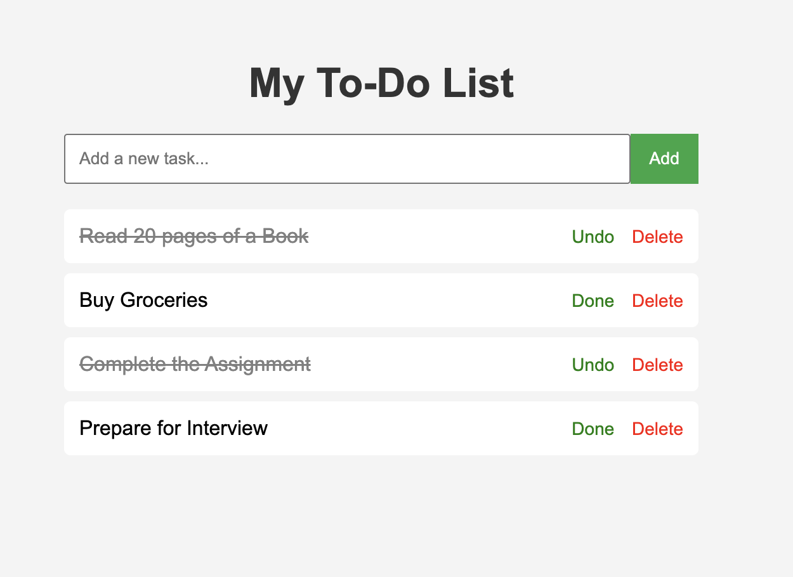

# To-Do List Web App 📝

A simple and functional To-Do List web application built using **Python (Flask)**.

## Features
- Add new tasks
- Delete tasks
- Clean and simple UI

## Tech Stack
- Python
- Flask
- HTML/CSS

## How to Run Locally

1. Clone the repository
```bash
git clone https://github.com/khushichauhan-codes/todo-web-app.git
cd todo-web-app
```

2. Install Flask
```bash
pip3 install flask
```

3. Run the app
```bash
python3 app.py
```

4. Open browser and go to `http://127.0.0.1:5000`

## Screenshots

## Author
Khushi Chauhan
